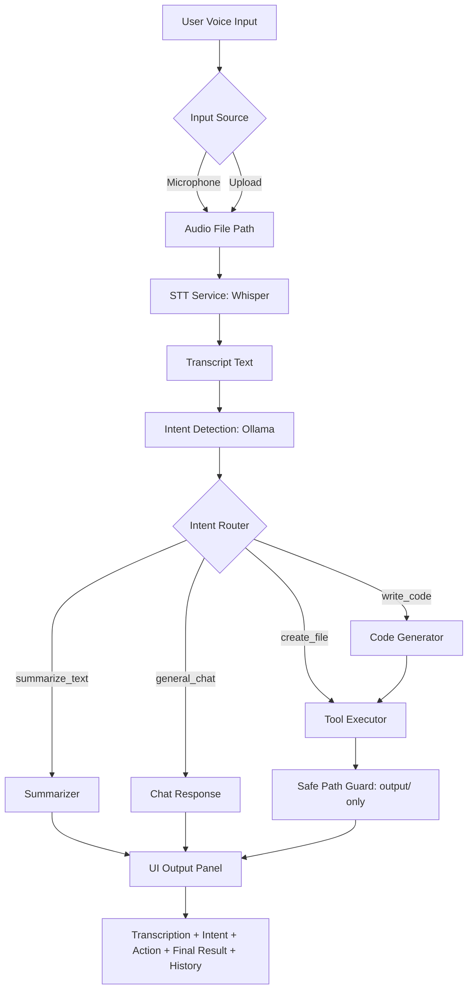

# NeuroVox Kunal

NeuroVox Kunal is a voice-controlled local AI agent that listens to user audio, transcribes speech, understands intent, executes safe local actions, and shows every step in a clean web UI.

## Vision

Build a practical local-first assistant where voice commands become real actions, without risking accidental system-wide file writes.

## Key Highlights

- Dual audio input: microphone and audio upload
- Local speech-to-text using HuggingFace Whisper
- Local LLM integration through Ollama for intent understanding and response generation
- Intent-driven tool execution
- Strict safety boundary: all file writes restricted to output/
- Human-in-the-loop confirmation for file operations
- Session history tracking in the UI
- Graceful fallback when Ollama is unavailable

## Supported Intents

- create_file
- write_code
- summarize_text
- general_chat

## End-to-End Flow



## Architecture

### 1. Core Layer

- Orchestration: src/core/agent.py
- App configuration: src/core/config.py

### 2. Service Layer

- STT service: src/services/stt.py
- LLM/intent service: src/services/llm_service.py

### 3. Tool Layer

- Action executor and safe local file operations: src/tools/executor.py

### 4. UI Layer

- Gradio interface and pipeline trigger: src/ui/gradio_app.py
- Launcher entry point: app.py

## Project Structure

```text
.
├── app.py
├── requirements.txt
├── output/
│   └── .gitkeep
└── src/
		├── core/
		│   ├── __init__.py
		│   ├── agent.py
		│   └── config.py
		├── services/
		│   ├── __init__.py
		│   ├── llm_service.py
		│   └── stt.py
		├── tools/
		│   ├── __init__.py
		│   └── executor.py
		└── ui/
				├── __init__.py
				└── gradio_app.py
```

## Quick Start

### 1. Clone

```bash
git clone https://github.com/Kunal88591/Ai-agent.git
cd Ai-agent
```

### 2. Create virtual environment

```bash
python3 -m venv .venv
source .venv/bin/activate
```

### 3. Install dependencies

```bash
pip install -r requirements.txt
```

### 4. Start Ollama (recommended)

```bash
ollama pull llama3.1:8b
ollama serve
```

### 5. Run the app

```bash
python app.py
```

## Example Commands

- Create a file:
	- Create a file named notes.txt
- Write code:
	- Create a Python file with a retry function in demo_retry.py
- Summarize text:
	- Summarize this paragraph: <your text>
- General chat:
	- Explain what a retry mechanism is

## Safety Design

- Path normalization and validation enforce output/ as write root
- Directory traversal outside output/ is blocked
- Optional UI confirmation before create/write operations

## Hardware Notes and Workarounds

- Default STT model: openai/whisper-small
- Default local LLM target: llama3.1:8b via Ollama
- On low-resource systems:
	- switch to whisper-tiny in src/core/config.py
	- use a smaller Ollama model
	- optionally replace local STT with API-based STT and document reason


## Contributor

- Kunal (Kunal88591)

